# RiskLens — поведенческий антифрод для финансовых операций

> Загружаете выгрузку транзакций — получаете ранжированный список подозрительных операций, объяснение по каждой и отчёт в Excel. Внутри: поведенческий профиль пользователя, интерпретируемые правила и ML-модель в одном конвейере.

[](https://python.org)
[](https://fastapi.tiangolo.com)
[](https://scikit-learn.org)
[](https://react.dev)
[-brightgreen)](#исследование)

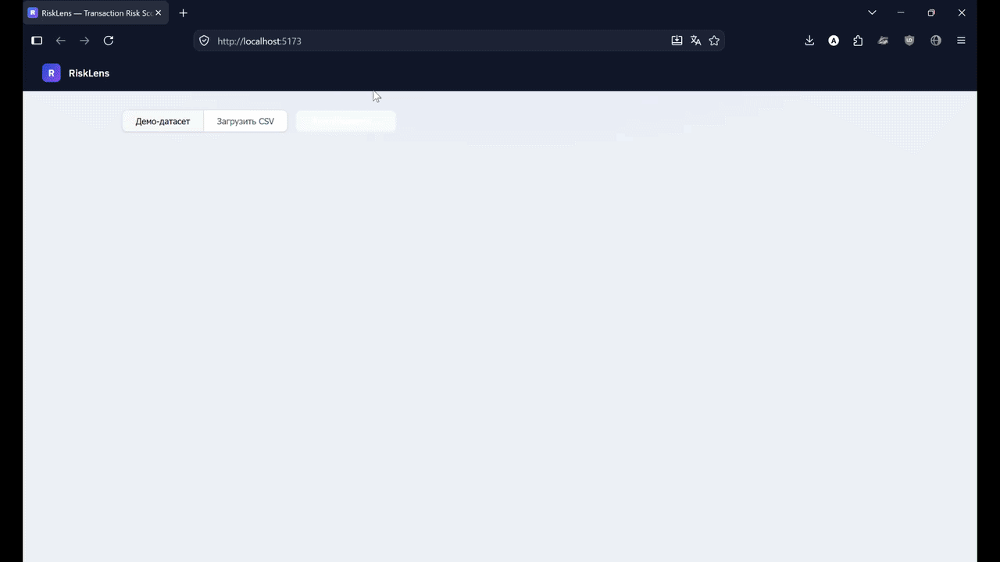

Выпускная квалификационная работа (Московский Политех, 2026, формат «Стартап как диплом»). Защищена на «отлично», результаты доложены на СНК-2026. Публичное демо отключено, систему можно поднять локально — см. [Быстрый старт](#быстрый-старт).

---

## Для кого

Для служб внутреннего контроля и финтех-компаний малого и среднего масштаба, у которых нет собственной ML-команды. Крупные антифрод-системы рассчитаны на масштаб банков, а ручной разбор выгрузок в Excel не использует поведенческий профиль и не масштабируется.

RiskLens работает как второй эшелон защиты: анализирует накопленные выгрузки и находит паттерны, которых не видно в отдельной транзакции, — постепенный «разогрев» счёта, серийную разведку лимитов, резкие отклонения от привычных сумм пользователя.

---

## Как это работает

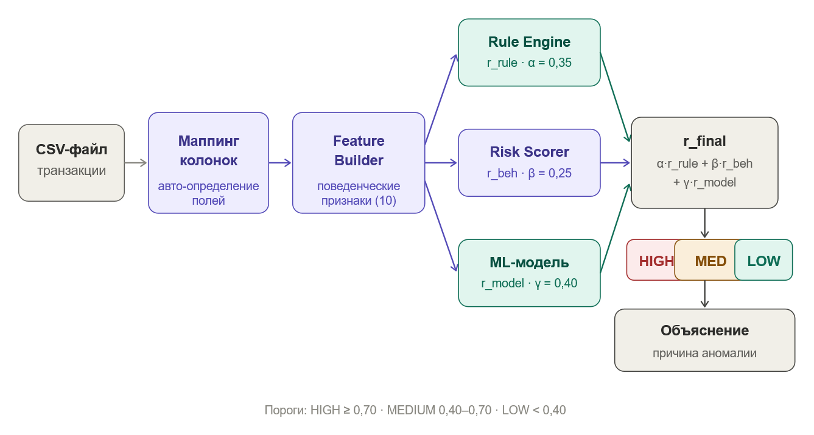

Конвейер из четырёх компонентов:

1. **Маппинг колонок** — определяет нужные поля во входном CSV без ручной настройки.
2. **FeatureBuilder** — считает десять поведенческих признаков по истории пользователя. Все агрегаты строятся только по предшествующим транзакциям, утечки из будущего нет.
3. **RuleEngine** — интерпретируемые правила с настраиваемыми порогами; сохраняет список сработавших для объяснения.
4. **RiskScorer** — собирает итоговую оценку:

```
r_final = α · r_rule + β · r_beh + γ · r_model        α + β + γ = 1
```

| Компонент | Что это | Вес по умолчанию |
|---|---|---|
| `r_rule` | скор правилового движка | α = 0.35 |
| `r_beh` | интегральный поведенческий риск-индекс | β = 0.25 |
| `r_model` | вероятность мошенничества от классификатора | γ = 0.40 |

Уровень риска: HIGH при `r_final` ≥ 0.70, MEDIUM от 0.40 до 0.70, LOW ниже. Веса и пороги меняются в конфиге без переобучения модели.

---

## Что видит аналитик

Сводка по выгрузке: распределение по уровням риска, топ операций по сумме, фильтры.

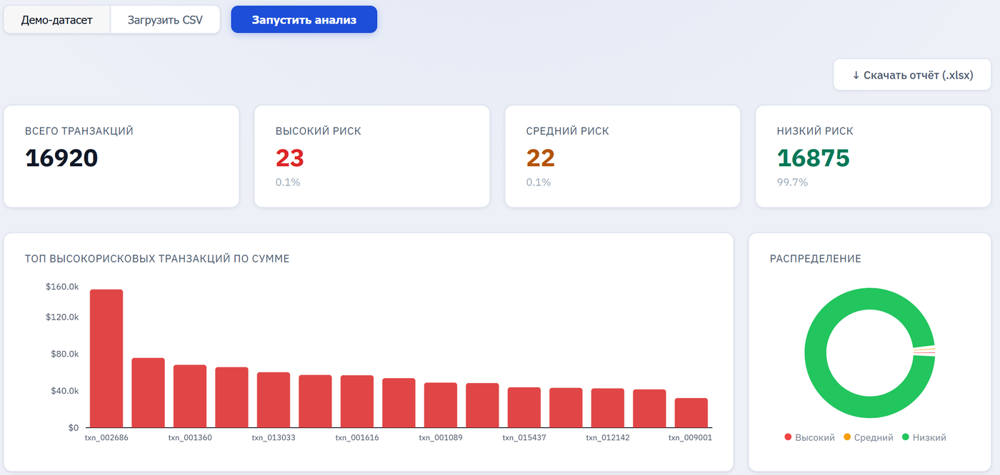

Таблица с риск-скором и сработавшими правилами по каждой операции — отсортирована так, что разбор начинается сверху.

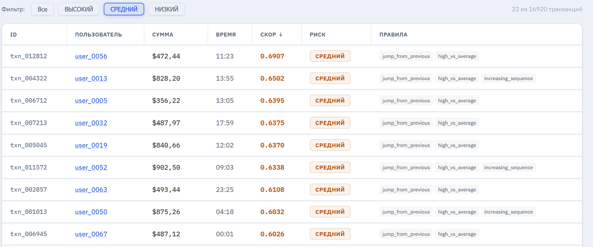

По клику на операцию открывается разбор: из чего сложился скор, почему операция попала в подозрительные, какие правила сработали. Там же аналитик фиксирует решение — подтверждённый фрод, ложная тревога или «на проверке» — и оставляет комментарий. По клику на пользователя открывается его профиль с историей и динамикой оценок.

<table>
<tr>
<td width="50%">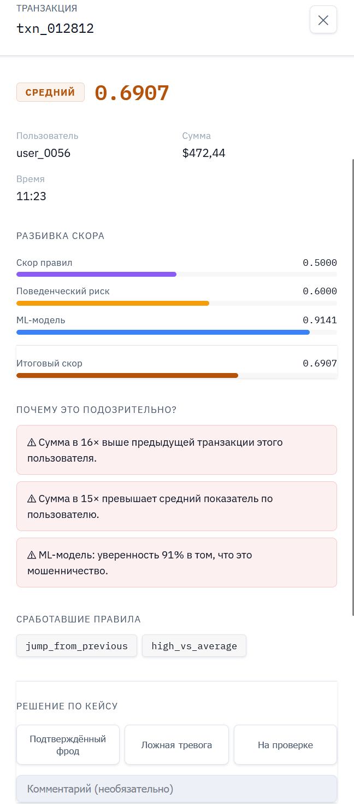</td>
<td width="50%">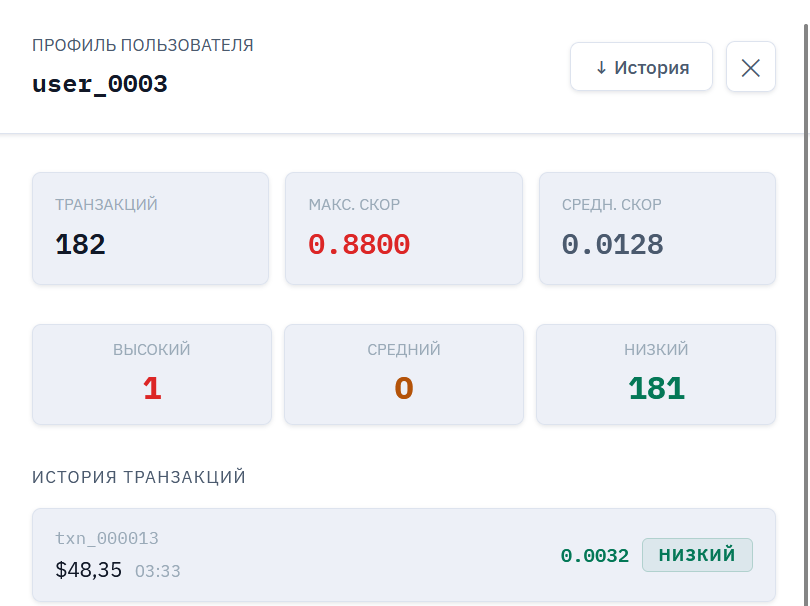</td>
</tr>
</table>

---

## Выгрузки

Отчёт по высокорисковым операциям за период: сумма, время, скор, уровень риска и решение аналитика с автором проверки.

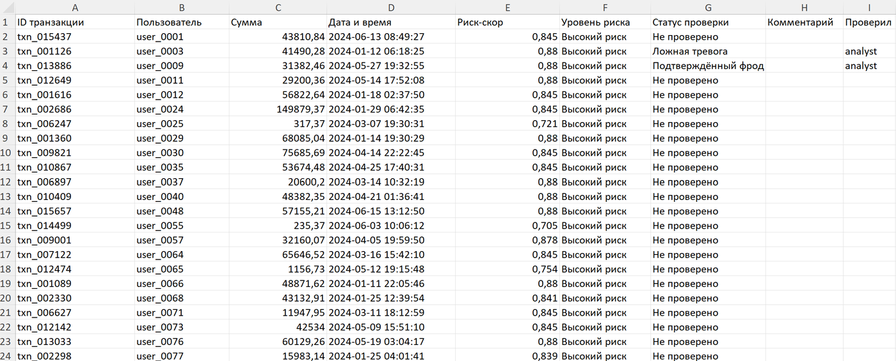

<details>
<summary>История отдельного пользователя</summary>

Полная история операций клиента с оценками — то, с чего начинается разбор конкретного кейса.

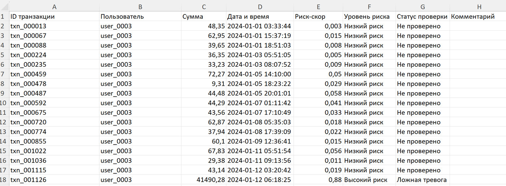

</details>

---

## Возможности

- Загрузка произвольного CSV с автоматическим определением колонок
- Трёхуровневая оценка риска с числовым скором и текстовым объяснением
- Разбор скора на три компонента и список сработавших правил
- Управление кейсами: решение аналитика и комментарий сохраняются
- Профиль пользователя с историей транзакций и динамикой оценок
- Экспорт в Excel: отчёт по высокорисковым операциям с фильтром по датам и история отдельного клиента
- REST API из 13 эндпоинтов, документация OpenAPI генерируется автоматически
- Работает только на суммах и времени операций, без персональных данных клиентов

---

## Исследование

Центральный вопрос работы: **при каких условиях поведенческие признаки дают значимый прирост качества и где проходят границы их применимости.**

### Данные

**IEEE-CIS Fraud Detection** (Vesta Corporation) — данные реального платёжного процессора. Из 590 540 транзакций исключены пользователи с историей короче 5 операций; идентификатор пользователя — `card1`.

| Параметр | Значение |
|---|---|
| Транзакций | 577 192 |
| Пользователей | 6 512 |
| Доля мошенничества | 3.5 % |
| Транзакций на пользователя | медиана 14, среднее 89 |
| Период наблюдения | 182 дня |

**PaySim** — синтетические мобильные платежи для внешней проверки: 325 933 транзакции, 2.52 % аномалий, большинство пользователей совершают 1–2 операции.

Из IEEE-CIS намеренно взяты только суммы и время, без identity-признаков (V1–V339, device info, email domain). Так вклад поведенческих признаков измеряется изолированно. Абсолютные значения ROC-AUC из-за этого ниже, чем у решений на полном наборе признаков, — здесь важен прирост, а не рекорд.

### Дизайн эксперимента

- Факторный план 2×2: два алгоритма × два набора признаков (базовый и расширенный) + ablation интегрального индекса
- **Базовый набор** (4 признака): `amount`, `running_total`, `transactions_last_24h`, `share_of_total`
- **Расширенный набор**: базовый + `previous_amount`, `diff_from_previous`, `amount_ratio_prev`, `avg_amount_before`, `diff_from_avg`, `amount_ratio_avg`, `is_increasing_3`, `behavioral_risk_score`
- **Random Forest**: 200 деревьев, max_depth = 8, class_weight = "balanced"
- **Logistic Regression**: StandardScaler + LR, class_weight = "balanced"
- 5-fold стратифицированная кросс-валидация (shuffle, random_state = 42), парный t-тест на уровне фолдов

### Основной результат

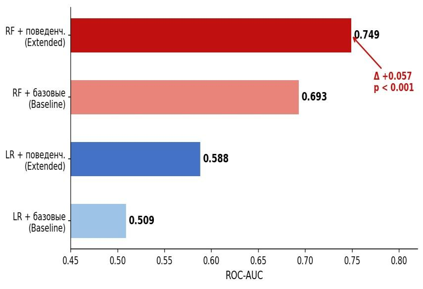

| Модель | Базовые | Расширенные | Δ ROC-AUC | t | p-value |
|---|---|---|---|---|---|
| Random Forest | 0.693 ± 0.006 | 0.749 ± 0.004 | **+0.057** | 55.1 | < 0.001 |
| Logistic Regression | 0.509 ± 0.002 | 0.588 ± 0.004 | **+0.079** | 42.1 | < 0.001 |

Прирост воспроизводится во всех пяти фолдах. Логистическая регрессия выигрывает больше: сама она нелинейные агрегаты извлечь не может, а поведенческие признаки дают их в готовом виде.

Низкие precision (~0.09) и F1 (~0.15) — следствие дисбаланса классов и сценария использования: скор ранжирует очередь ручной проверки, а не блокирует операции автоматически. Для такой задачи основная метрика — качество ранжирования.

### Пороговый эффект глубины истории

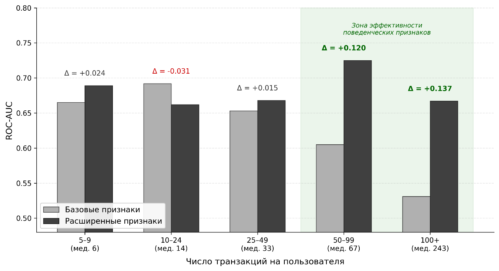

| Транзакций на пользователя | Базовые | Расширенные | Δ ROC-AUC |
|---|---|---|---|
| 5–9 (медиана 6) | 0.665 | 0.689 | +0.024 |
| 10–24 (медиана 14) | 0.692 | 0.662 | −0.031 |
| 25–49 (медиана 33) | 0.653 | 0.668 | +0.015 |
| 50–99 (медиана 67) | 0.605 | 0.725 | **+0.120** |
| 100+ (медиана 243) | 0.531 | 0.667 | **+0.137** |

На коротких историях поведенческие агрегаты зашумлены и прирост нестабилен. **От 50 транзакций на пользователя** признаки дают устойчивый вклад. Качество базовой модели при этом падает с ростом истории: у активных пользователей траты разнообразнее, и абсолютная сумма операции говорит меньше, чем её отклонение от личной нормы.

**Внешняя проверка на PaySim** подтверждает вывод: без истории расширенные признаки прироста не дают (0.802 ± 0.004 против 0.808 ± 0.003 на базовых).

### Какие признаки работают

Важность по Джини (Random Forest, расширенный набор):

| Признак | Важность | Тип |
|---|---|---|
| `avg_amount_before` | 0.361 | поведенческий |
| `amount` | 0.144 | базовый |
| `diff_from_avg` | 0.112 | поведенческий |
| `running_total` | 0.070 | базовый |
| `amount_ratio_avg` | 0.066 | поведенческий |

Суммарная важность поведенческих признаков — 0.679 против 0.260 у базовых.

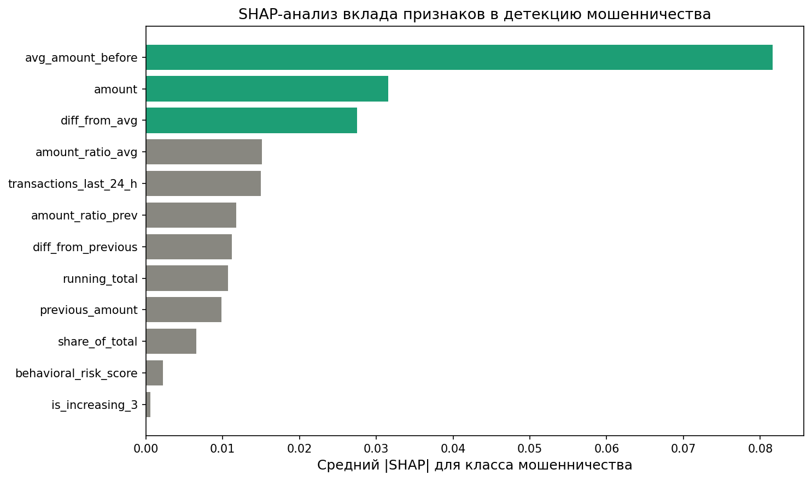

SHAP-анализ на выборке из 1 000 транзакций даёт тот же порядок лидеров: `avg_amount_before` (0.082), `amount` (0.032), `diff_from_avg` (0.027). Главный сигнал для модели — не сама сумма, а то, насколько она типична для конкретного пользователя.

### Ablation

Исключение `behavioral_risk_score` из признаков модели меняет ROC-AUC в пределах 0.002. Качество обеспечивают отдельные поведенческие признаки, а индекс нужен в формуле `r_final` для непрерывного интерпретируемого ранжирования.

---

## Поведенческие признаки

| Признак | Формула | Смысл |
|---|---|---|
| `amount_ratio_prev` | aᵢ / aᵢ₋₁ | отклонение от предыдущей операции |
| `amount_ratio_avg` | aᵢ / ā_prev | отклонение от среднего по истории |
| `share_of_total` | aᵢ / Σaₖ | доля в обороте пользователя |
| `transactions_last_24h` | число операций за 24 часа | частота операций |
| `is_increasing_3` | I(aᵢ₋₂ < aᵢ₋₁ < aᵢ) | серия нарастающих сумм (разведка лимитов) |

Вспомогательные агрегаты: `previous_amount`, `diff_from_previous`, `avg_amount_before`, `diff_from_avg`, `running_total`.

## Когда применять и ограничения

- Поведенческий компонент работает при истории **от 50 транзакций** на пользователя. Для коротких историй стоит снизить β до 0.05–0.10 и перенести вес на правила и модель — переобучение не нужно.
- Система делает пакетный анализ выгрузок. Для блокировки в реальном времени она не предназначена.
- Модель обучена на e-commerce транзакциях IEEE-CIS. Перенос на корпоративные платёжные потоки требует валидации и, возможно, дообучения на локальных данных.
- Текущая инфраструктура рассчитана на демонстрационную нагрузку.

---

## Быстрый старт

Нужны Python 3.10+ и Node.js. Два терминала.

**Бэкенд:**

```bash
pip install -r requirements.txt
python run_api.py
# API:          http://localhost:8000
# Документация: http://localhost:8000/docs
```

**Фронтенд:**

```bash
cd frontend
npm install
npm run dev
# http://localhost:5173
```

Дальше: «Демо-датасет» → «Запустить анализ». Демо считает 16 920 синтетических транзакций — 80 поведенческих профилей с историей 150–200 операций на пользователя.

Обученная модель сериализована в joblib на scikit-learn 1.8.0; на другой версии при загрузке появятся предупреждения о совместимости формата.

<details>
<summary><b>REST API — 13 эндпоинтов</b></summary>

| Метод | Эндпоинт | Назначение |
|---|---|---|
| GET | `/health` | проверка готовности сервера |
| GET | `/demo` | анализ демонстрационного датасета |
| POST | `/score/batch` | пакетный скоринг (JSON) |
| POST | `/score/upload` | скоринг загруженного CSV с маппингом колонок |
| POST | `/score/single` | скоринг одной транзакции с учётом истории из кэша |
| POST | `/score/detect` | автоопределение колонок CSV |
| GET | `/users` | пользователи в кэше |
| GET | `/users/{user_id}` | профиль пользователя |
| POST | `/cases/{transaction_id}/review` | решение аналитика по кейсу |
| GET | `/cases` | все проверенные кейсы |
| GET | `/cases/{transaction_id}` | решение по конкретной транзакции |
| GET | `/export/report` | Excel-отчёт по высокорисковым транзакциям (`date_from`, `date_to`) |
| GET | `/export/user/{user_id}` | Excel-история пользователя |

</details>

<details>
<summary><b>Структура репозитория</b></summary>

```
risklens/
├── artifacts/models/     # обученная модель (joblib)
├── data/
├── outputs/
├── screenshots/          # изображения для README
├── src/
│   ├── api/              # FastAPI: endpoints, schemas, dependencies
│   ├── config/           # AppConfig на dataclass: веса, пороги, параметры
│   ├── data/             # подготовка датасетов (IEEE-CIS, PaySim)
│   ├── evaluation/       # кросс-валидация, статистические тесты
│   ├── features/         # FeatureBuilder: 10 поведенческих признаков
│   ├── models/           # train.py, predict.py (RF + LR)
│   ├── rules/            # RuleEngine с конфигурируемыми предикатами
│   ├── scoring/          # RiskScorer: r_final = α·r_rule + β·r_beh + γ·r_model
│   └── utils/            # IO, генератор синтетических данных
├── frontend/             # React + Recharts дашборд
├── main.py
├── demo_app.py
├── run_api.py
└── requirements.txt
```

</details>

## Стек

**Бэкенд:** Python 3.10+, FastAPI, scikit-learn, pandas, joblib, openpyxl

**Фронтенд:** React 18, Recharts, Vite

**Оценка:** стратифицированная кросс-валидация, парный t-тест, ablation, важность по Джини, SHAP

---

## Публикация

Аширов А. А. Разработка системы оценки риска аномальных транзакций на основе поведенческих признаков пользователей и методов машинного обучения. Доклад на студенческой научной конференции Московского Политеха (СНК-2026).
