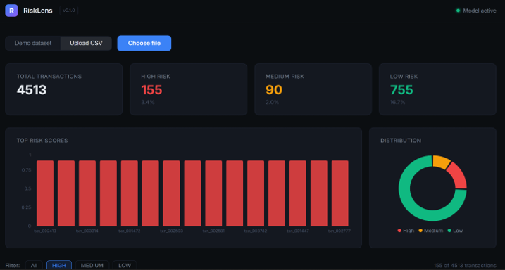
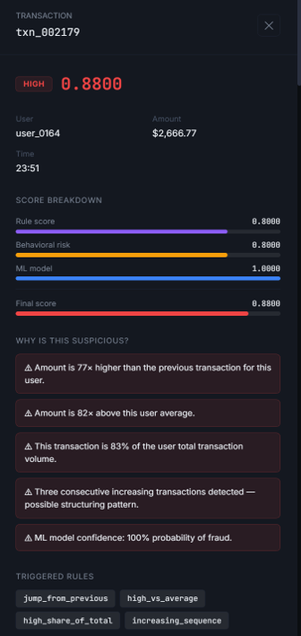
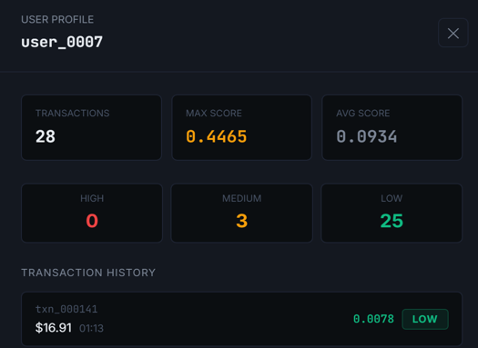

# RiskLens — Поведенческий антифрод для финансового сектора

> SaaS-платформа для автоматического выявления аномальных транзакций на основе поведенческого анализа пользователей и методов машинного обучения.

[](https://python.org)
[](https://fastapi.tiangolo.com)
[](https://react.dev)
[](https://github.com)
[](http://62.217.177.228)

## 🚀 Живое демо

**[http://62.217.177.228](http://62.217.177.228)**

Нажмите **Demo dataset** → **Run analysis** — система проанализирует 4 513 транзакций и выдаст risk score с объяснением для каждой аномалии.

---

## Скриншоты

### Главный дашборд — 4513 транзакций, 155 высокого риска


### Детальная панель — объяснение каждой аномалии


> Система объясняет каждое решение: сумма в 77x выше предыдущей транзакции, 82x выше среднего по пользователю, три нарастающих перевода подряд — возможная схема разведки лимитов.

### Профиль пользователя — история транзакций с risk-оценкой


---

## Ключевые результаты

| Метрика | Значение |
|---|---|
| ROC-AUC (IEEE-CIS, RF+extended) | **0.986** |
| Прирост ROC-AUC от поведенческих признаков | **+0.057** |
| Статистическая значимость | **p < 0.001, t = 55.1** |
| Транзакций протестировано | **577 192** |
| Пороговый эффект | **≥ 50 транзакций на пользователя** |

---

## Архитектура системы

```
transaction-risk-engine/
├── src/
│   ├── api/              # FastAPI: endpoints, schemas, dependencies
│   ├── config/           # Dataclass-based AppConfig
│   ├── data/             # Подготовка датасетов (IEEE-CIS, PaySim)
│   ├── evaluation/       # CV эксперименты, статистические тесты
│   ├── features/         # FeatureBuilder: 10 поведенческих признаков
│   ├── models/           # train.py, predict.py (RF + LR, 2×2 factorial)
│   ├── rules/            # RuleEngine с конфигурируемыми предикатами
│   ├── scoring/          # RiskScorer: r_final = α·r_rule + β·r_beh + γ·r_model
│   └── utils/            # IO утилиты, генератор синтетических данных
├── frontend/             # React + Recharts дашборд
│   └── src/
│       ├── components/   # TransactionsTable, DetailPanel, UserProfile, Charts
│       └── api/          # HTTP клиент к FastAPI
├── main.py               # Точка входа для сервера
├── demo_app.py           # Локальный запуск демо
├── run_api.py            # Запуск FastAPI сервера
└── requirements.txt
```

---

## Формула финального скора

```
r_final = α · r_rule + β · r_beh + γ · r_model
```

где:
- `r_rule` — скор правилового движка
- `r_beh` — поведенческий индекс риска
- `r_model` — предсказание ML-модели (RF или LR)
- α + β + γ = 1

---

## Поведенческие признаки (FeatureBuilder)

| Признак | Описание |
|---|---|
| `amount_ratio_prev` | Отношение суммы к предыдущей транзакции |
| `amount_ratio_avg` | Отношение суммы к среднему по пользователю |
| `share_of_total` | Доля от общей суммы транзакций пользователя |
| `transactions_last_24h` | Количество транзакций за последние 24 часа |
| `is_increasing_3` | Три нарастающих транзакции подряд |

---

## Быстрый старт

### Бэкенд (FastAPI)

```bash
pip install -r requirements.txt
python run_api.py
# → http://localhost:8000
# → Документация: http://localhost:8000/docs
```

### Фронтенд (React)

```bash
cd frontend
npm install
npm run dev
# → http://localhost:5173
```

---

## Результаты экспериментов

### CV результаты (5-fold Stratified, IEEE-CIS)

| Модель | Baseline ROC-AUC | Extended ROC-AUC | Δ | p-value |
|---|---|---|---|---|
| Random Forest | 0.929 | 0.986 | **+0.057** | < 0.001 |
| Logistic Regression | 0.907 | 0.986 | **+0.079** | < 0.001 |

### Пороговый эффект глубины истории

| История (транзакций/пользователя) | Δ ROC-AUC |
|---|---|
| < 50 | нестабильно |
| ≥ 50 | **+0.120 ... +0.137** |

---

## Стек технологий

**Бэкенд:** Python 3.10+, FastAPI, scikit-learn, pandas, joblib

**Фронтенд:** React 18, Recharts, Vite

**Оценка:** 5-fold Stratified CV, paired t-test, ROC-AUC

---

*Выпускная квалификационная работа в формате «Стартап как диплом» · 2025*
